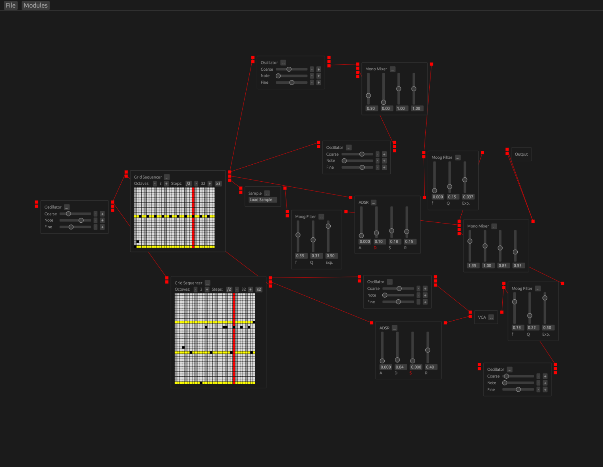

# s-rack

[](https://www.rust-lang.org/)
[](https://github.com/sharph/s-rack/actions/workflows/rust.yml)
[](https://www.recurse.com/)

A modular softsynth



* [egui](https://github.com/emilk/egui) based UI
* Runs natively or [in the web browser via WASM](https://github.com/emilk/egui)

## Building and running

Like most Rust apps, s-rack uses Cargo to build:

```bash
cargo run
```

or

```bash
cargo build
```

## Developing for web

s-rack uses [Trunk](https://trunkrs.dev/) to manage building for web.

You can `trunk serve` to start a live-reloading environment or `trunk build`
to create a build in `dist/`.
